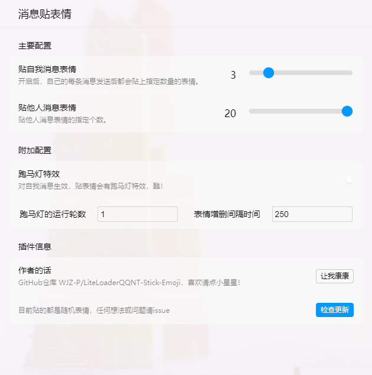
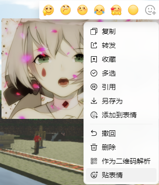

## 一款让你的消息变得炫酷的插件

<!-- PROJECT SHIELDS -->

[![Contributors][contributors-shield]][contributors-url]
[![Forks][forks-shield]][forks-url]
[![Stargazers][stars-shield]][stars-url]
[![Issues][issues-shield]][issues-url]
[![MIT License][license-shield]][license-url]
[![LinkedIn][linkedin-shield]][linkedin-url]

<!-- PROJECT LOGO -->

  
  <h1 align="center">Stick Emoji</h1>
  

    <a href="https://github.com/WJZ-P/LiteLoaderQQNT-Stick-Emoji">查看Demo</a>
    ·
    <a href="https://github.com/WJZ-P/LiteLoaderQQNT-Stick-Emoji/issues">报告Bug</a>
    ·
    <a href="https://github.com/WJZ-P/LiteLoaderQQNT-Stick-Emoji/issues">提出新特性</a>
  

  

<h2 align="center">"回忆像是阴霾中的烟火， 凝住眼泪才能看清轮廓； 
&nbsp;&nbsp;&nbsp;是否想要问空荡荡的我， 用心换取心值值不值得？"</h2>

## 目录

- [Grab RedBag](#projectname)
    - [目录](#目录)
        - [上手指南](#上手指南)
            - [开发前的配置要求](#开发前的配置要求)
            - [**插件安装步骤**](#安装步骤)
        - [**使用方法**](#使用方法)
        - [版权说明](#版权说明)
        - [鸣谢](#鸣谢)
        - [重要声明](#重要声明)

## 上手指南

###### 开发前的配置要求

1. 请安装LiteLoader，项目地址为 https://github.com/LiteLoaderQQNT/LiteLoaderQQNT
   
2. 下面是社区开发的LiteLoader快捷安装脚本项目，新手请直接下载下面的即可。
   https://github.com/Mzdyl/LiteLoaderQQNT_Install/

#### 此处提供两个链接：

- [LiteLoader QQNT 下载地址](https://github.com/LiteLoaderQQNT/LiteLoaderQQNT/releases)
- [LiteLoader QQNT 安装脚本](https://github.com/Mzdyl/LiteLoaderQQNT_Install/releases)

#### 对于网络不好的用户，可以使用以下直链进行下载：
- [LiteLoader QQNT 安装器直链][LL-installer-link]
- [QQ9.9.15.26909_x64 版本直链][oldQQ-download-link]

###### 安装步骤

1. 下载release中的最新版本
2. 解压后把整个解压出来的文件夹拖动到Plugins目录下即可。
3. 重启QQ，LiteLoader会自动加载Grab RedBag插件。

### 注意，如果使用了上面的install脚本安装liteloader，QQ设置会自带插件商店，在插件商店里可以一键安装本插件。

# 使用方法

## 1.设置页面：

  

## 2.给他人贴表情：

  

### 右键别人的消息，最下方即为贴表情选项

#### 注：给别人一次性贴太多表情会刷对方的屏！请勿滥用哦！(≧△≦)

## 版权说明
该项目签署了EPL-2.0 license
授权许可，详情请参阅 [LICENSE](https://github.com/WJZ-P/LiteLoaderQQNT-Stick-Emoji/blob/main/LICENSE)

## 鸣谢

- [LiteLoader QQNT](https://github.com/LiteLoaderQQNT/LiteLoaderQQNT?tab=readme-ov-file)
- [LiteLoader Euphony](https://github.com/LiteLoaderQQNT/LiteLoaderQQNT?tab=readme-ov-file)

## 重要声明
### 本项目仅供交流学习使用，**禁止**用于一切非法用途！任何问题概不负责。(｡•́︿•̀｡) 

## 📝 To Do List

- [ ] **？还没有！**

## 如果您喜欢本项目，请给我点个⭐吧(๑>◡<๑)！

## ⭐ Star 历史

<!-- links -->

[your-project-path]:WJZ-P/LiteLoaderQQNT-Stick-Emoji

[contributors-shield]: https://img.shields.io/github/contributors/WJZ-P/LiteLoaderQQNT-Stick-Emoji.svg?style=flat-square

[contributors-url]: https://github.com/WJZ-P/LiteLoaderQQNT-Stick-Emoji/graphs/contributors

[forks-shield]: https://img.shields.io/github/forks/WJZ-P/LiteLoaderQQNT-Stick-Emoji.svg?style=flat-square

[forks-url]: https://github.com/WJZ-P/LiteLoaderQQNT-Stick-Emoji/network/members

[stars-shield]: https://img.shields.io/github/stars/WJZ-P/LiteLoaderQQNT-Stick-Emoji.svg?style=flat-square

[stars-url]: https://github.com/WJZ-P/LiteLoaderQQNT-Stick-Emoji/stargazers

[issues-shield]: https://img.shields.io/github/issues/WJZ-P/LiteLoaderQQNT-Stick-Emoji.svg?style=flat-square

[issues-url]: https://img.shields.io/github/issues/WJZ-P/LiteLoaderQQNT-Stick-Emoji.svg

[license-shield]: https://img.shields.io/github/license/WJZ-P/LiteLoaderQQNT-Stick-Emoji.svg?style=flat-square

[license-url]: https://github.com/WJZ-P/LiteLoaderQQNT-Stick-Emoji/blob/main/LICENSE

[linkedin-shield]: https://img.shields.io/badge/-LinkedIn-black.svg?style=flat-square&logo=linkedin&colorB=555

[linkedin-url]: https://linkedin.com/in/shaojintian

[oldQQ-download-link]:https://ats-prod.oss-accelerate.aliyuncs.com/91ff35732557ef7d8415050a85973801

[LL-installer-link]:https://ats-prod.oss-accelerate.aliyuncs.com/18734247705198dcb594916e8ba1facc

